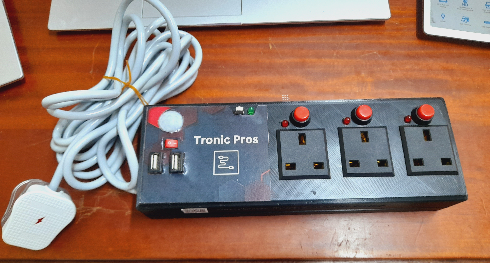
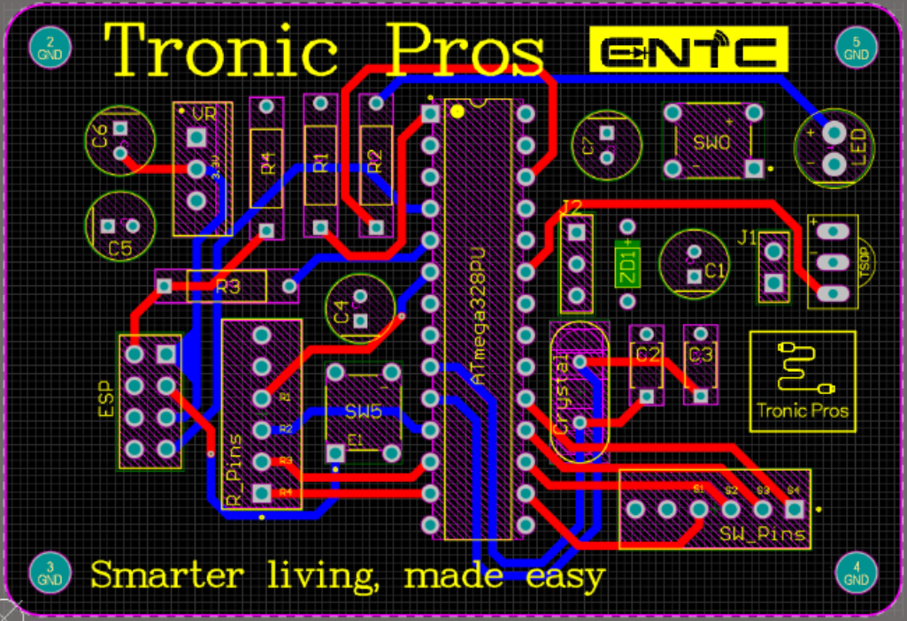
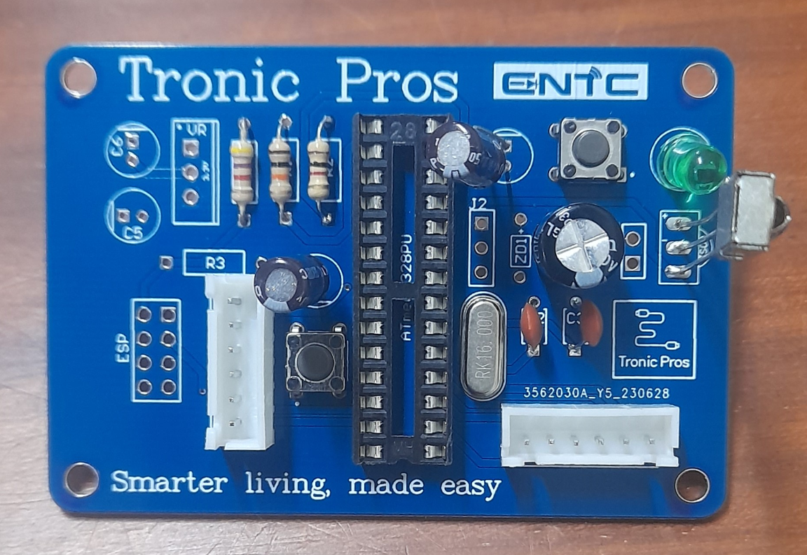
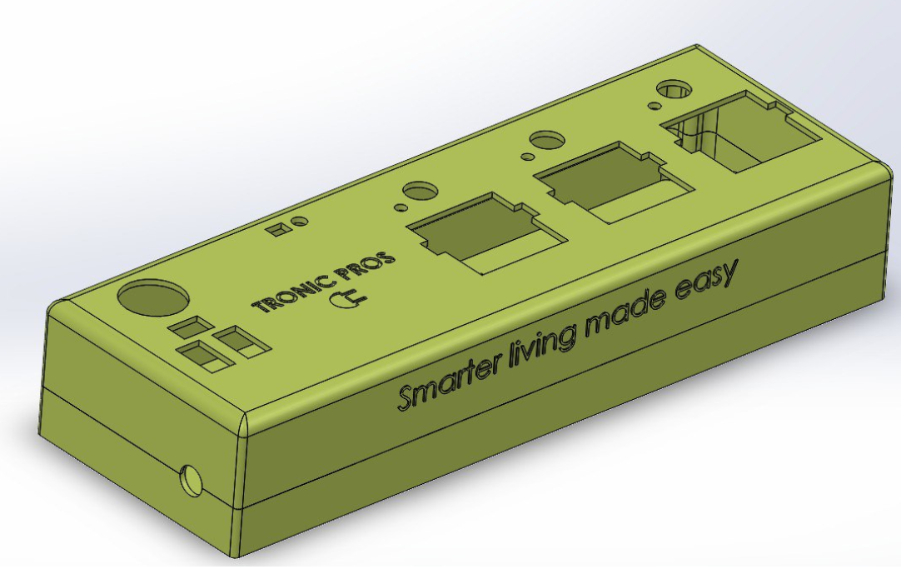

# Smarty-Plug
* Smarty Plug is an IoT-integrated smart extension cord powered by [ATmega328](https://github.com/RuchiraAbeywardhane/Smarty-Plug/blob/main/Data%20sheets/ATMEGA328.PDF) & [ESP8266](https://github.com/LasithaAmarasinghe/Smarty-Plug/blob/main/Data%20sheets/ESP8266.PDF).
* This is developed for the semester 2 project under EN 1190: Engineering Design Project.
  

## Features
 
* [Voice Controlling](https://github.com/RuchiraAbeywardhane/Smarty-Plug/blob/main/Voice%20Control.mp4) - supports Google Assistant and Amazon Alexa
* [Controlling by Mobile Phone](https://github.com/RuchiraAbeywardhane/Smarty-Plug/blob/main/Remote%20control%2C%20Google%20home.mp4) - using Google Home 
* [USB Adaptive Charging](https://github.com/RuchiraAbeywardhane/Smarty-Plug/blob/main/USB%20charging.mp4)
* [Controlling by Remote Controller](https://github.com/RuchiraAbeywardhane/Smarty-Plug/blob/main/Remote%20control%2C%20Google%20home.mp4)
* Scheduling - by connecting to Google Calendar

## What made us select this as our project?

* We chose to develop this smart extension cord because it solves everyday challenges in managing electronic devices efficiently and safely.
* This provides practical solutions to energy wastage and device control. This project aligns with our goal of enhancing user convenience, promoting energy conservation, and integrating emerging IoT technologies for a more sustainable future.

## Areas of Opportunity

* Remote Troubleshooting - Including diagnostic tools that help users troubleshoot issues remotely could enhance user experience and minimize technical support needs.
* Third-Party Integrations - Partnering with other smart home device manufacturers to create integrated solutions that can work together seamlessly.
* Energy Usage Analytics - Including a feature to track and display device energy usage data can empower users to make informed decisions about their energy consumption.

## Why "Smarty Plug"?

* Cost Efficiency
* Energy Efficiency and Safety
* To Reduce Carbon Footprint
* Convenient Home Automation
* Device Battery Health
* Remote Access & Monitoring

## Hardware Specifications

* [ESP8266](https://github.com/RuchiraAbeywardhane/Smarty-Plug/blob/main/Data%20sheets/ESP8266.PDF)
* [ATmega328](https://github.com/RuchiraAbeywardhane/Smarty-Plug/blob/main/Data%20sheets/ATMEGA328.PDF)
* USB Ports
* Relays
* Push Button Switches
* Power Step Down Module

## Software Specifications

* Arduino IDE
* Solid Works
* Altium
* Google Home

## PCB Design

## PCB 

## Solidworks Design

## Team

* Hasitha Gallella
* Ruchira Abeywardhane
* Lasitha Amarasinghe
* Sahan Abeyrathna

## License
 
 * This project is licensed under the MIT License. See the [LICENSE](MIT-LICENSE.txt) file for details.

## For More Information - [Project Report](https://github.com/RuchiraAbeywardhane/Smarty-Plug/blob/main/Project%20Report.pdf)
